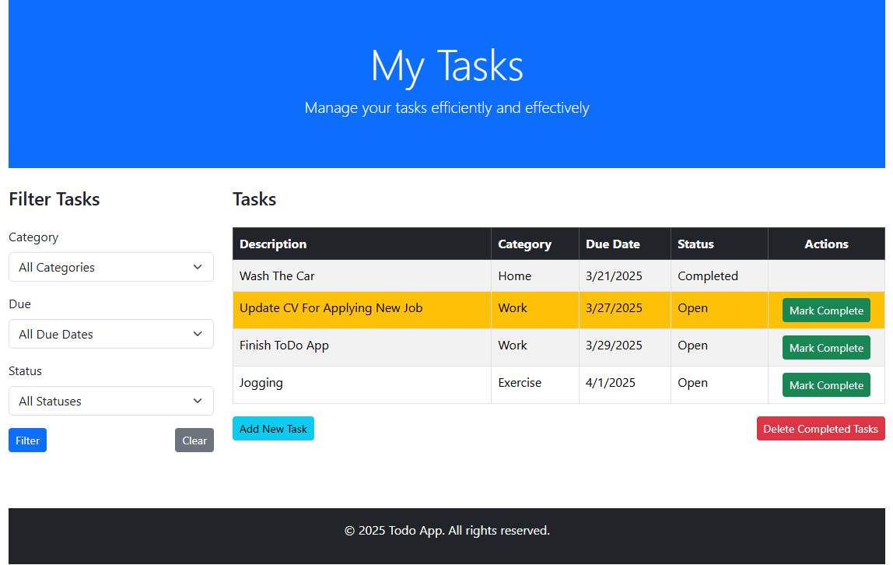

ToDoApp
This project is a Simple Task Management Application that allows users to create, update, and manage tasks efficiently. It uses ASP.NET Core MVC and Git for version control, and can be run locally or deployed to a server for access.

Prerequisites
Before you begin, ensure you have the following tools installed:

Visual Studio (Community/Professional/Enterprise Edition)
Git (for version control)
A GitHub account (for pushing and pulling changes)

Getting Started
Clone the repository
Open Visual Studio.
Navigate to File > Open > Repository.
In the dialog box, paste the URL of your GitHub repository and click Clone.
Run the project
Open the project in Visual Studio.
Press F5 or click the Start button to run the project locally.

Git Workflow in Visual Studio

Stage Changes
In Visual Studio, follow these steps to stage changes for commit:
Open Git Changes from the View menu or press Ctrl + Shift + G.
You will see the list of modified files under Changes.
Right-click a file and select Stage to stage specific files.
Alternatively, use Stage All at the top of the Changes pane to stage all changes.

Commit Changes
Once your changes are staged, commit them with a message:
In the Git Changes window, type a meaningful commit message in the Commit Message box.
Click Commit Staged to commit the changes.

Push Changes to Remote
To push your committed changes to your remote GitHub repository:
After committing, click the Push button in the Git Changes window to push your changes to GitHub.

Pull Changes from Remote
To pull the latest changes from the remote repository:
Click the Pull button in the Git Changes window.

Acknowledgments
ASP.NET Core
Bootstrap
Visual Studio
Git
GitHub
